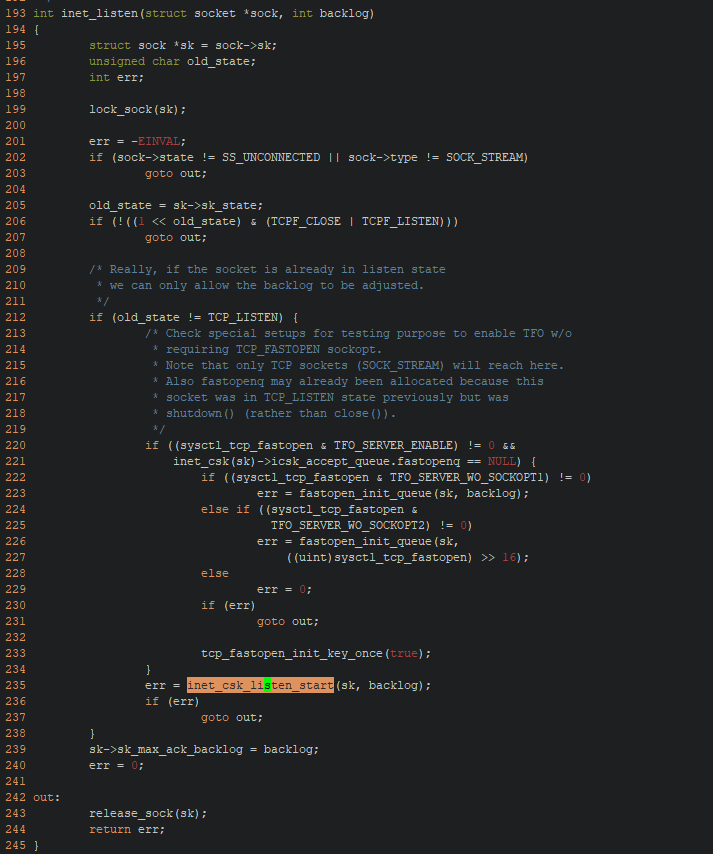
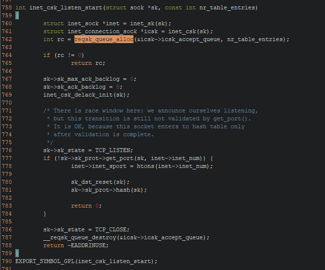
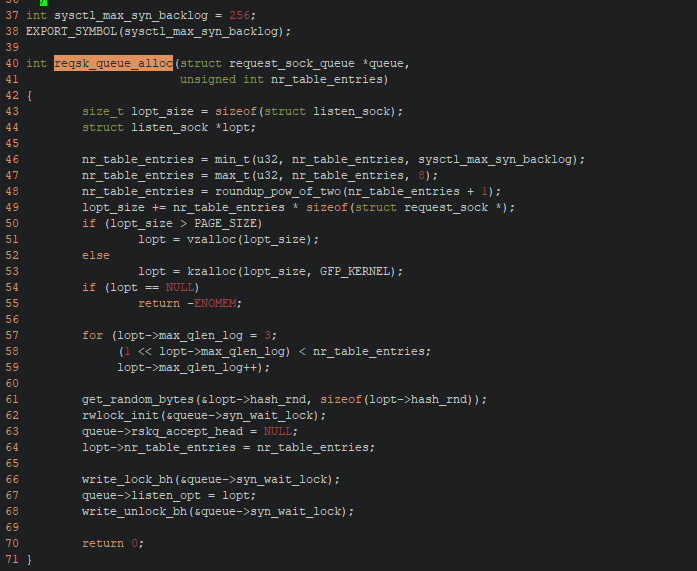

## ## the explantation of syscall listen's second argument **backlog**
------

Almost every programming had learned writing simple socket program at school, and while writing network service program, you almost always use system call *listen* to open a port and start set it to listening state just as its name hint,  then if there's incomming connection, you can accept it and do the next business. the syscall *listen* has two parameters,

```c
int listen(int sockfd, int backlog);
```

I believe not everybody understand the second parameter's real meaning, and I will show that next.

*backlog*, its literal meaning:

> an accumulation of jobs not done or materials not processed that are yet to be dealt with

sounds like to set how many jobs not to be done? yeah, close to the answer! the arguments is a queue len to be setting.

let's go on reading the manpage of *listen*:

> The behavior of the backlog argument on TCP sockets changed with Linux 2.2.  Now it specifies the queue length for completely established sockets waiting to be accepted, instead of the number of incomplete connection requests.  The maximum  length  of  the
> ​       queue for incomplete sockets can be set using /proc/sys/net/ipv4/tcp_max_syn_backlog.  When syncookies are enabled there is no logical maximum length and this setting is ignored
>
> If  the  backlog argument is greater than the value in /proc/sys/net/core/somaxconn, then it is silently truncated to that value; the default value in this file is 128.

after reading the manpage, you should understand argument backlog is used to set established sockets waitting queue, and you should also noticed two system variables, ***somaxconn, tcp_max_syn_backlog***.

somaxconn is the *established* connection queue length limit,  this is a typical producer-consumer problem, syscall accept play a consumer role, and pop a connection from the queue, kernel play a producer role, and push a connected connection to the queue, but as you know, every robust buffer queue has upper limit length, and the somaxconn  is that value.

tcp connection is initialized through a handshake procudure, and after this procudure, the connection state was channged to ESTABLISHED. Before the last ACK was received, the connection is  in syn-queue if syncookies was not setting, and tcp_max_syn_backlog was the syn-queue length. 

let's check it from the linux kernel code, and make sure  how was the backlog working.


as you can see at line 1586, backlog value is set to somaxconn if its value more bigger. line 1588 is just a length value security check, just ignore it, line 1590 is the real working code. the function pointer address was function '*inet_listen*', and code as follow:

​	

line 235 was its real routine, let's go on the code path:





the final queue length was compute from line 46,47,48.

now, you have understand the final value is not righ the value you given, that will be influenced by *somaxvalue* and *sysctl_max_syn_backlog*, and these two value was usually setted by System Operation Engineer.